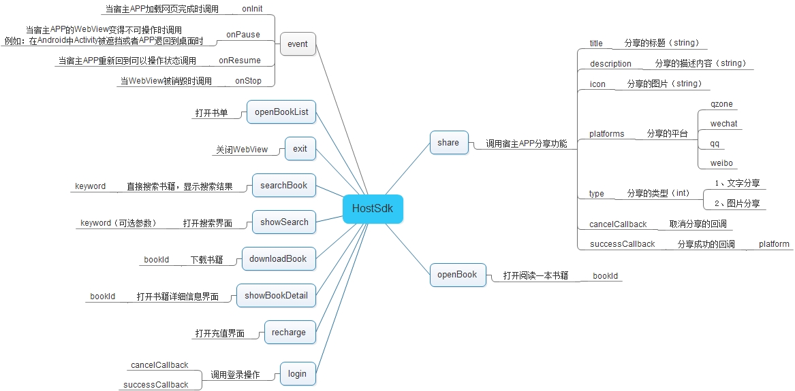

#  书香云集js与客户端交互文档

## 设计概要
#### 设计目的
> 为了能够使JS与 **书香云集** 客户端的交互更加顺利，重新设计了交互机制。
> 之前交互机制的不足之处：
> * 采用自定义的schema方式只能由js调起客户端的相应功能。
> * window.location = "xxx://xxx" 这种形式容易阻断部分js功能的执行。
> * 缺少操作的回调机制。比如何时分享成功和分享失败。
> 
> 新的交互机制加入了回调的支持，加入了生命周期概念，目的在于可以对整个交互过程进行操作把控。

> Android 4.2 以下的系统有严重安全隐患。可以使用 [Safe Java-JS WebView Bridge](https://github.com/pedant/safe-java-js-webview-bridge)

#### URL约定
> 新的交互机制约定了一套URL规则，用于控制页面加载的方式，例如，是否需要全屏加载，是否允许关闭等。具体形式如：
> `http://www.sxyj.net/book_read/bookid_e809304b4c434b9fbe00a75eb2f7e31c.html?hostsdk=fullscreen,uncloseable`
>
>| 参数名 | 默认生效 | 备注 |
| --- | --- | --- |
| fullscreen | 否 | 全屏加载页面。没有标题栏，没有底部工具条 |
| uncloseable | 否 | 不允许关闭页面（由页面控制关闭） |
| unshareable | 否 | 是否显示分享 |
| openpush | 否 | push 方式打开窗口（ios） |
| openpresent | 否 | present 方式打开窗口（ios） |

#### 链接处理
> 客户端应该支持使用target指定的打开方式，如果 `target` 为 `_blank` 则在新窗口打开页面。否则在当前窗口加载新页面
```html
<a href="http://www.baidu.com" target="_blank">链接</a>
```

> 等价于通过 `window.hostsdk.openPage("http://www.baidu.com")` 打开页面

#### 安全机制
> 为了保证客户端的安全，防止打开第三方不可信任的地址。造成恶意读取用户信息的安全隐患。设计了安全机制。
> 在适当的时候，客户端向服务端请求一个可信任网址列表（客户端自行考虑）。也可以在访问页面之前，向服务端特定的接口验证是否是可信任地址。如果是，则将 `userId` 等敏感参数通过 `onInit` 传递给网页。
> 可信任地址允许使用简单通配符 `*` 例如 `*.ireadercity.com*`

## 结构图



## 生命周期
>生命周期事件回调是App客户端主动调用，用于告知/通知 js,以便于js可以在适当时候做特殊处理。

##### onInit(初始化)
`window.hostsdk.onInit(version,userId,idfa)`

*参数：*

|参数名|类型|备注|
|---|---|---|
|version|String|App版本|
|userId|String|用户ID、临时用户为deviceId|
|idfa|String||

##### onPause(暂停执行)
`window.hostsdk.onPause()`
##### onResume(恢复执行)
`window.hostsdk.onResume()`
##### onStop(结束执行)
`window.hostsdk.onStop()`

*返回值：*

|取值|备注|
|---|---|
|0|关闭|
|1|阻止关闭|

## 接口方法

###方法一览

|方法名|备注|
|---|---|
|share|分享|
|openBook|打开并阅读一本书|
|openBookList|打开指定的书单|
|searchBook|直接搜索书籍，显示搜索结果|
|downloadBook|下载指定的书籍|
|showBookDetail|显示书籍详情|
|recharge|打开充值界面|
|login|打开登录界面|
|openPage|新窗口打开页面|
|exit|关闭当前页面|

### share 分享
> 分享形式根据参数判断。比如，icon为空的情况下，分享文字内容。有description和icon的情况下，就是图文内容。
>##### js调用
```javascript
window.hostsdk.share(
	'标题',
	'http://www.baidu.com',
	'描述',
	'http://m.ireadercity.com/webapp/img/logo.png',
	'qzone,wechat',
	function(){
		alert("取消分享");
	},
	function(platform){
		alert("分享成功！分享的平台为：" + platform);
	}
);
```

> 参数：
> 
|参数名|类型|备注|
|---	|---|---|
| title	| String | 要分享的标题 |
| url | String | 要分享的链接地址	|
| description | String | 要分享的文本描述内容 |
| icon | String | 分享的图片 |
| platforms | String | 可以分享平台多个用逗号分割：qzone,qq,wechat,wechatcircle,weibo |
| cancelCallback | Function | 取消分享时的回调 |
| successCallback | Function | 分享成功之后的回调 并携带 platform 参数，表示用户选择的平台 |

### openBook 打开并阅读一本书

>##### js调用
```javascript
window.hostsdk.openBook('6b8bca1c2df24d9d844a9e0ac999cb07','ab2cafb54ddb462a9cf50e47815feaab');
```

> 参数：
> 
|参数名|类型|备注|
|---	|---|---|
| bookId | String | 书籍的Id |
| chapterId | String | 章节Id （可选） |

### openBookList 打开一个书单

>##### js调用
```javascript
window.hostsdk.openBookList('e809304b4c434b9fbe00a75eb2f7e31c');
```

> 参数：
> 
|参数名|类型|备注|
|---	|---|---|
| bookListId | String | 书单的Id |

### searchBook 搜索书籍，显示搜索结果

>##### js调用
```javascript
window.hostsdk.searchBook('总裁');
```

> 参数：
> 
|参数名|类型|备注|
|---	|---|---|
| keyword | String | 搜索关键字 |

### downloadBook 下载指定书籍(可以多本)

>##### js调用
```javascript
window.hostsdk.downloadBook(
	'e809304b4c434b9fbe00a75eb2f7e31c,e809304b4c434b9fbe00a75eb2f7e31c',
	function(bookId){
		alert("下载书籍失败" + bookId);
	},
	function(bookId){
		alert("下载书籍成功" + bookId);
	}
);
```
> 参数：
> 
|参数名|类型|备注|
|---	|---|---|
| bookId | String | 书籍的Id |
| cancelCallback | Function | 下载失败的回调 |
| successCallback | Function | 下载成功后的回调 |

### showBookDetail 显示书籍详情

>##### js调用
```javascript
window.hostsdk.showBookDetail('e809304b4c434b9fbe00a75eb2f7e31c');
```

> 参数：
> 
|参数名|类型|备注|
|---	|---|---|
| bookId | String | 书籍的Id |

### recharge 打开充值界面
> 用户调用充值过程中可能会

>##### js调用
```javascript
window.hostsdk.recharge(
	function(orderId){
		if(orderId!=""){
			alert("用户取消充值：取消的订单为：" + orderId);
		} else {
			alert("用户放弃充值");
		}		
	},
	function(orderId){
		alert("充值成功，充值订单号：" + orderId);
	}
);
```

> 参数：
> 
|参数名|类型|备注|
|---	|---|---|
| cancelCallback | Function | 取消充值回调（如果用户充值过程中创建了订单，但是取消了支付，可以携带`orderId`参数。如果没有创建订单，则传递`""`） |
| successCallback | Function | 充值成功之后的回调 并携带 orderId 参数，表示用户充值的订单号 |

### login 打开登录界面

>##### js调用
```javascript
window.hostsdk.login(
	function(){
		alert("取消登录");
	},
	function( userId ){
		alert("登录成功，用户ID：" + userId);
	}
);
```

> 参数：
> 
|参数名|类型|备注|
|---	|---|---|
| cancelCallback | Function | 取消登录时的回调 |
| successCallback | Function | 登录成功之后的回调 并携带 userId 参数，表示用户的id |

### openPage 新窗口打开页面

>##### js调用
```javascript
window.hostsdk.openPage("http://www.baidu.com/");
```

> 参数：
> 
|参数名|类型|备注|
|---	|---|---|
| url | String | url链接 |

### exit 关闭当前页面

>##### js调用
```javascript
window.hostsdk.exit();
```